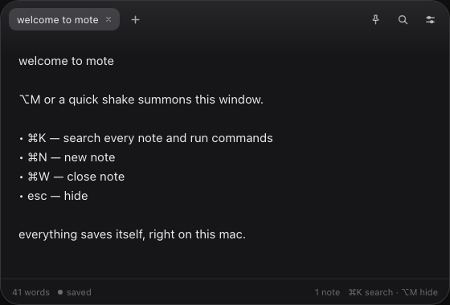
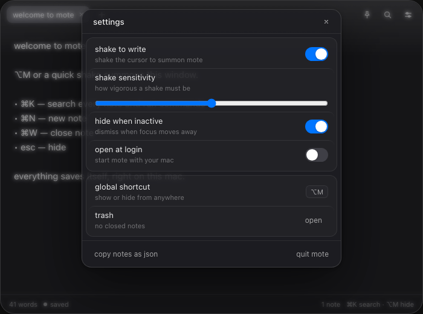

<p align="center">
  
</p>

<h1 align="center">Mote</h1>

<p align="center">
  <strong>A glass overlay notepad for macOS.</strong><br />
  Shake the cursor, jot a thought, and it is out of your way again.
</p>

<p align="center">
  <a href="#install"></a>
  <a href="LICENSE"></a>
  
</p>

<p align="center">
  
</p>

Mote lives in your menu bar and appears exactly where you are. No Dock icon, no
window juggling, no accounts. Every note stays on your Mac.

## Features

- **Shake to write** — shake the mouse cursor and the overlay drops in at your
  pointer. Shake again (or press `Esc`) to dismiss it.
- **Global shortcut** — `⌥M` shows or hides Mote from any app, including
  native full-screen apps.
- **Pinned stickies** — pin a note and it becomes an always-on-top sticky that
  stays visible across Spaces and over full-screen apps.
- **Command palette** — `⌘K` searches every note with fuzzy matching and runs
  app commands (new note, pin, export, trash, quit).
- **Tabs & trash** — keep several notes open; closing one moves it to the trash
  where it can be restored or deleted forever.
- **Undo/redo** — per-note history with coalesced typing steps.
- **Autosave** — notes persist locally the moment you type.
- **Open at login** — optional launch agent, toggleable from Settings or the
  menu bar.
- **Hide when inactive** — optionally dismiss the overlay as soon as focus
  moves elsewhere.

## Install

### Download

Grab the latest `Mote_x.y.z_aarch64.dmg` from
[Releases](../../releases), open it, and drag **Mote** into `Applications`.

Mote is currently ad-hoc signed (not notarized), so macOS may warn on first
launch. Right-click the app and choose **Open**, or clear the quarantine flag:

```bash
xattr -dr com.apple.quarantine /Applications/Mote.app
```

### Build from source

Requirements: macOS 13+, [Rust](https://rustup.rs), Node.js 20+, and
[pnpm](https://pnpm.io).

```bash
pnpm install
pnpm tauri build
```

The app bundle and installer are written to:

```text
src-tauri/target/release/bundle/macos/Mote.app
src-tauri/target/release/bundle/dmg/Mote_0.1.0_aarch64.dmg
```

For development with hot reload:

```bash
pnpm tauri dev
```

## Keyboard shortcuts

| Shortcut        | Action                       |
| --------------- | ---------------------------- |
| `⌥M`            | Show / hide Mote             |
| `⌘K`            | Search notes & commands      |
| `⌘N`            | New note                     |
| `⌘W`            | Close note to trash          |
| `⌘⇧P`           | Pin / unpin note             |
| `⌘,`            | Settings                     |
| `⌘⇧E`           | Copy all notes as JSON       |
| `⌃⇥` / `⌃⇧⇥`   | Next / previous tab          |
| `⌘1` … `⌘9`     | Jump to tab                  |
| `⌘Z` / `⌘⇧Z`    | Undo / redo                  |
| `Tab`           | Indent                       |
| `Esc`           | Dismiss overlay / hide Mote  |

<p align="center">
  
</p>

## How it works

Mote is a [Tauri 2](https://tauri.app) app: a Rust backend wrapping a webview UI
with no frontend framework.

- The **shake detector** samples the cursor position from Core Graphics and
  looks for four direction reversals within 700 ms — a real shake, not a drag or
  jitter.
- The **overlay** is a non-activating `NSPanel` (converted from Tauri's main
  window via [`tauri-nspanel`](https://github.com/ahkohd/tauri-nspanel)) raised
  to `NSStatusWindowLevel` with `CanJoinAllSpaces | FullScreenAuxiliary`, so it
  appears over any Space — including another app's native full-screen mode —
  without stealing focus or switching Spaces. The panel is clipped to the same
  corner radius as the UI shell.
- **Sticky notes** are separate always-on-top windows labelled `pin-<note-id>`
  that sync their body with the main window over Tauri events.
- **Storage** is the webview's `localStorage`; window size is persisted to
  `~/Library/Application Support/com.jaykatariya.mote/window.json`.

## Project structure

```text
src/                     Frontend (vanilla TypeScript)
  app.ts                 Main window UI, palette, settings, trash
  sticky.ts              Pinned sticky window UI
  store.ts               Note document, persistence, schema validation
  search.ts              Fuzzy matching, snippets, highlighting
  history.ts             Per-note undo/redo stack
  tauri.ts               Typed wrapper around the Rust commands/events
src-tauri/               Rust backend
  src/lib.rs             Windows, tray, global shortcut, pins, IPC commands
  src/shake.rs           Cursor shake detection
  src/window_state.rs    Window size persistence
  capabilities/          Tauri permission capabilities
```

## Tests

```bash
pnpm test                        # frontend unit tests (Vitest)
cd src-tauri && cargo test       # Rust unit tests
cd src-tauri && cargo clippy     # lints
```

## Privacy

Mote never talks to the network. Notes, settings, and window state are stored
locally on your Mac and nowhere else.

## Contributing

Issues and pull requests are welcome. Please run `pnpm test`, `cargo test`, and
`cargo clippy` before opening a PR.

## License

[MIT](LICENSE) © Jay Katariya
